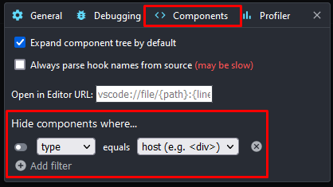

Poniżej znajdują się zadania, które należy wykonać w domu. Na pracowni prowadzący sprawdzi efekty działań i zada pytania odnośnie poszczególnych kroków.

W ramach kolejnych list będziesz tworzyć prostą aplikację w Reactcie. W celu weryfikacji zadania, należy założyć nowe repozytorium w którym znajdować się będzie twoja pierwsza apka Reactowa. Adres pod którym znajduje się repozytorium oraz dostęp do niego (jeśli jest to repozytorium ukryte) należy wysłać prowadzącym.

# Instalacja środowiska

Przygotuj swoje środowisko pod kolejne zadania.

-   Zainstaluj `node`, najlepiej z użyciem `nvm`. Wykonaj komendy `node -v` oraz `npm -v` żeby potwierdzić, że skutecznie zainstalowałeś `node`.

# Pierwsza apka Reactowa, część 1

Używając [CRA](create-react-app.dev) stwórz swoją pierwszą aplikację React.

-   Twoja aplikacja powinna używać TypeScriptu. W tym celu znajdź w dokumentacji odpowiednią flagę.
-   Stwórz dwa nowe komponenty: `Logo` i `HelloWorld`. Jeden z nich (dowolny) powinien być komponentem klasowym a jeden funkcyjnym.
-   Komponent `Logo` powinien renderować logo React'a znajdujące się obecnie w komponencie `App`.
-   Komponent `HelloWorld` powinien renderować napis `Hello World!`.
-   Komponent `App` powinien renderować komponenty `Logo` i `HelloWorld`.
-   Twoja aplikacja powinna wyglądać jak na załączonym obrazku
    

    
Screenshot

    
    

-   Przerób komponent `HelloWorld` tak, żeby renderował dwa tagi `p`, jeden z zawartością `Hello` a drugi z zawartością `World`. Rozwiąż ewentualne problemy, wyjaśnij skąd się biorą.
-   ### Umieść powstałą aplikację w repozytorium

# Debugowanie Apki Reactowej, część 1

Wejdź na stronę https://wndtaw-todo-list.netlify.app/ i używając React Developer Tools oraz konsoli przeglądarki zdebuguj aplikację.

W celu weryfikacji że ten punkt został wykonany, stwórz nowy folder w repozytorium z twoją pierwszą apką Reactową. Będziesz w nim umieszczać zrzuty ekranu potwierdzające że kolejne kroki tego zadania zostały wykonane.

-   Używając React Developer Tools, sprawdź jak nazywają się komponenty renderujące poszczególne elementy.
    -   Wykonaj zrzut ekranu z listą wszystkich komponentów i umieść go w odpowiednim folderze.
-   React Developer Tools pozwala na odfiltrowywanie komponentów, których nie chcesz oglądać. Przykładowo, domyślnie ukrywa tak zwane `host components` (np `div`). Zacznij od wyłączenia tego filtru z poziomu ustawień.
    -   Wykonaj zrzut ekranu z listą wszystkich aktualnie widocznych komponentów i umieść go w odpowiednim folderze.
-   Ponownie użyj filtra, tym razem odfiltrowując tagi `input` i `button`.

    -   Wykonaj zrzut ekranu z listą wszystkich aktualnie widocznych komponentów i umieść go w odpowiednim folderze.

-   ### Wszystkie trzy screeny powinny znajdować się w repozytorium

Podpowiedź do zadania (zanim rozwiniesz, spróbuj to zrobić samodzielnie)

Po zainstalowaniu React Developer Tools w konsoli pojawi się nowa zakładka "Components". W niej znajduje się lista komponentów.

Nad listą komponentów widoczny jest pasek wyszukiwania (numer 2).

-   Po jego lewej jest narzędzie pozwalające na zaznaczenie na stronie interesujących nas komponentów (numer 1).

-   Po prawej powinien znajdować się przycisk ustawień (numer 3).

    -   Obecnie interesuje nas tylko zakładka `Components`, a dokładniej część `Hide components where...`. Możesz tam usunąć obecne filtry a także dodać nowe, klikając `Add filter`, wybierając `name` i wpisując odpowiednie wyrażenie regularne (albo dodając wielokrotnie nowe filtry i wpisując nazwę).

    

